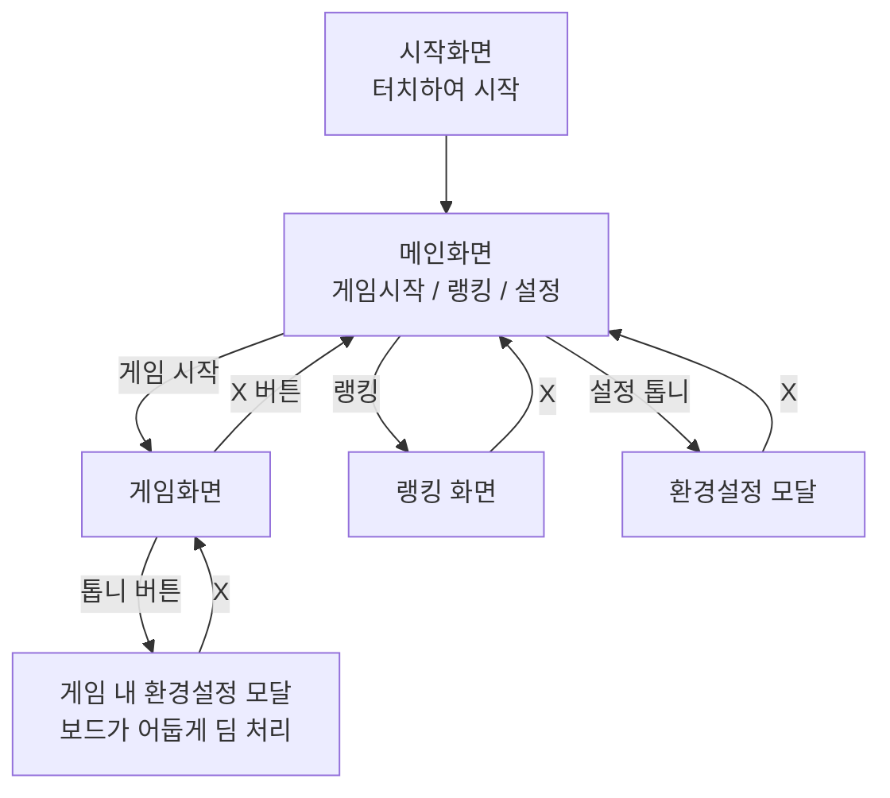

# Pawn&Run — 인게임 UI 스펙 (모바일)

원본 목업: `design/ui-mockups/*.pdf` (와이어프레임 + 6개 화면 고해상도 목업). 이 문서는 그 목업을 Unity로 그대로 구현하기 위한 파악 결과 + 준비 자료입니다.

## 화면 흐름

## 화면별 구성

### 1. 시작화면 (Splash)
- 배경: 체크보드 텍스처 타일링 (`tex_board_checker.png`)
- 중앙: 나무 액자 스타일 로고 카드 — "PAWN & RUN / 폰 & 런", 카드 좌우 하단에 폰 실루엣 장식(`icon_pawn.png`)
- 하단 안내 텍스트: "화면을 터치하여 시작!"
- 인터랙션: 화면 아무 곳이나 터치 → 메인화면 전환

### 2. 메인화면
- 배경: 시작화면과 동일한 체크보드 타일
- 우상단: 원형 톱니 아이콘 버튼(청록색 원 배경, `icon_gear.png`) → 환경설정 모달
- 중앙: 동일한 로고 카드
- 로고 아래 버튼 2개 (세로 스택)
  - **게임 시작** — 초록색 채움 버튼
  - **랭킹** — 연노랑 채움 버튼
- 버튼 스타일: 둥근 사각형, 검정 얇은 테두리, 중앙 정렬 텍스트

### 3. 환경설정 모달 (메인화면에서 톱니 클릭)
- 메인화면 위에 오버레이로 뜸 (배경 살짝 어둡게, 로고 카드 일부 가려짐)
- 우상단: 빨간 원형 X 닫기 버튼(`btn_close_x.png`)
- 본문: 주황색 패널
  - **배경음** 라벨 + 슬라이더
  - **효과음** 라벨 + 슬라이더
  - 슬라이더는 얇은 가로 트랙 + 사각형 손잡이(썸)

### 4. 랭킹 화면
- 배경: 체크보드 타일
- 우상단: 빨간 X 닫기 버튼 → 메인화면
- 상단: 로고 카드 (제목 아래 "랭킹" 서브타이틀 추가)
- 리스트: 1~8위, 각 행 = [순번 박스] + [아바타 아이콘] + [닉네임+숫자 박스]
  - 아바타는 기본 플레이스홀더 아이콘(둥근 로봇 얼굴 모양, 벡터 도형 — 래스터 에셋 없음, Unity에서 기본 아바타 스프라이트로 새로 제작 필요)
  - 닉네임 표시 형식 예시: "닉네임 1234"
- 리스트 영역 오른쪽에 얇은 스크롤바 인디케이터

### 5. 게임화면
- 배경: 잔디 텍스처(`tex_grass_bg.png`, 반복 타일링으로 보임)
- 상단 스탯 바 (갈색 패널)
  - 좌: `HIGH SCORE` 라벨 박스 + 값 박스 (2행: HIGH SCORE / SCORE)
  - 스탯 바로 아래: 시계 아이콘(`icon_clock.png`) + `03:00` 타이머 박스, 그 오른쪽에 빨간 X(종료) + 청록 톱니(설정) 원형 버튼
- 보드: 5×7, 오렌지/탠 체커 패턴, 갈색 프레임으로 감쌈. 플레이어 폰은 흰 실루엣, 맨 아래 행 중앙
- 하단: 이동 버튼 3개 (↖ 전진-좌포획 / ↑ 전진 / ↗ 우포획), 흰 배경에 검정 화살표 아이콘, 텍스트 라벨 없음(아이콘만)
- **웹 프로토타입과의 차이**: 턴(turn) 카운터 표시 없음 → 이 UI에서는 스탯 바에 HIGH SCORE/SCORE만 노출

### 6. 게임 내 환경설정 모달 (게임화면에서 톱니 클릭)
- 게임화면 위 오버레이, 뒤쪽 보드/스탯 바가 회색조로 딤 처리(일시정지 느낌)
- 환경설정 모달과 동일한 배경음/효과음 슬라이더 구성
- X로 닫으면 게임 재개

## 에셋 매니페스트

목업 PDF에서 실제 래스터 이미지로 추출해 `Assets/Art/UI/`에 저장함 (알파 채널 포함, 원본 PDF에서 SMask 병합):

| 파일 | 크기 | 용도 |
|---|---|---|
| `icon_gear.png` | 96×96 | 설정 버튼 아이콘 (흰색, 배경은 별도 원형 도형으로 합성 필요) |
| `tex_board_checker.png` | 250×250 | 시작/메인/랭킹 화면 배경 체크보드 타일 |
| `btn_close_x.png` | 667×686 | 닫기(X) 버튼 — 이미 완성된 원형 글로시 버튼 그래픽 |
| `icon_pawn.png` | 96×96 | 폰 실루엣 아이콘 (로고 카드 장식용) |
| `tex_grass_bg.png` | 740×555 | 게임화면 배경 잔디 텍스처 |
| `icon_clock.png` | 71×69 | 타이머 옆 시계 아이콘 |

**만들어야 하는데 목업엔 래스터 에셋이 없는 것들:**
- 청록색 원형 배경(톱니 버튼용) — 단색 원, Unity에서 Image + 단색으로 바로 구현 가능
- 랭킹 리스트의 기본 아바타 아이콘(둥근 로봇 얼굴) — 벡터 도형이라 새로 그리거나 유사 아이콘 대체 필요
- 나무 액자 로고 카드 프레임, 게임 보드의 갈색 프레임, 버튼들의 단색 배경(초록/연노랑/주황) — 전부 단색+둥근모서리 Sprite(9-slice)로 구현 가능, 별도 텍스처 불필요

**라이선스 주의:** `tex_grass_bg.png`는 사진 톤의 스톡 이미지로 보입니다. 목업 제작 시 어디서 가져온 에셋인지(무료 스톡/구매/직접 촬영) 확인 후, 실제 출시 빌드에 쓰기 전에 라이선스를 꼭 확인해주세요.

## 색상 참고 (목업에서 육안 추출, 근사치)

| 용도 | 색상 |
|---|---|
| 배경 체크보드 밝은 칸 | `#F5C98E` 근사 |
| 배경 체크보드 어두운 칸 | `#D68B3E` 근사 |
| 로고 카드 배경 | `#E9DE9A` 근사 (연노랑) |
| 로고 카드 테두리 / 나무 프레임 | `#6B3E1E` 근사 (진갈색) |
| 게임 시작 버튼 | `#5FA83B` 근사 (초록) |
| 랭킹 버튼 | 로고 카드와 동일 연노랑 |
| 설정 모달 배경 | `#D6862E` 근사 (주황) |
| 닫기 버튼 | `#D9362E` ~ `#E9645A` 그라데이션 (빨강) |
| 설정 톱니 버튼 배경 | 청록 (`#2FA6A6` 근사) |

정확한 값은 Unity에서 디자이너 눈대중보다 목업 PDF를 열어 스포이드로 재확인하는 걸 권장합니다.

## 다음 단계 (실제 구현 시)

이 리포는 아직 Unity 에디터로 열어본 적이 없는 상태입니다 (씬 파일 없음). 실제 구현은 에디터에서 직접:
1. `Assets/Scenes`에 씬 생성
2. Canvas(Screen Space - Overlay, 세로 모바일 해상도 기준 앵커) 위에 화면별 GameObject/Panel 구성
3. 위 에셋들을 Sprite로 임포트 (Texture Type: Sprite (2D and UI), 체크보드/잔디는 Wrap Mode Repeat 고려)
4. 스크립트(`Assets/Scripts`)로 화면 전환 상태머신 연결

C# 스크립트가 필요해지면 이어서 요청해주세요.
